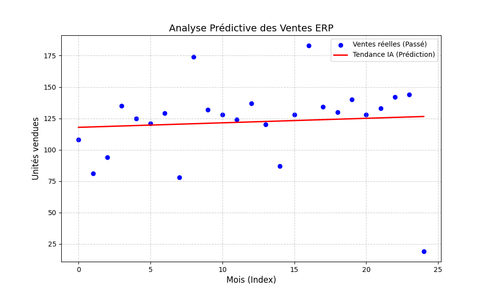

# 🚀 Smart-ERP : Gestion Commerciale & IA Prédictive


## 📌 Présentation du Projet
Ce projet est un **Enterprise Resource Planning ** conçu pour simuler la gestion d'une entreprise de vélo. Il intègre un moteur d'intelligence artificielle pour transformer les données de vente brutes en outils d'aide à la décision.

### 🌟 Fonctionnalités Clés
* **Gestion ERP (Laravel 11) :** Système complet de clients, produits et commandes (1000+ transactions simulées).
* **Analyse de Données (Pandas) :** Nettoyage et agrégation automatique des flux de ventes.
* **IA Prédictive (Scikit-Learn) :** Modèle de **Régression Linéaire** pour anticiper la demande du mois prochain.
* **Visualisation (Matplotlib) :** Génération automatique de graphiques de tendances.

---

## 📊 Analyse Prédictive
Voici un exemple du rendu généré par le moteur Python après analyse de l'historique SQL :



> **Interprétation :** La ligne rouge représente la tendance calculée par l'IA. Elle permet d'ajuster les stocks avant que la rupture ne survienne.

---

## 🛠️ Architecture Technique
Le projet utilise une architecture **interopérable** :
1.  **Backend :** Laravel API (PHP 8.2) expose les données métier.
2.  **Data Engine :** Scripts Python isolés pour le traitement mathématique.
3.  **Infrastructure :** Environnement conteneurisé sous **Docker**.

---

## 🚀 Installation & Lancement

### 1. Démarrer l'environnement
```bash
docker compose up -d --build
```

### 2. Configuration initiale
1. **Copier le fichier d'environnement**:
```bash 
cp .env.example .env
```
2. **Installer les dépendances PHP**:
```bash
docker compose exec app composer install
```
3. **Générer la clé d'application**:
```bash
docker compose exec app php artisan key:generate
```

### 3. Base de données (Migrations & Seeders)
**Crée la structure des tables et génère automatiquement les 1000 transactions de test : :**
```bash
docker compose exec app php artisan migrate:fresh --seed
 ```

### 4. Analyse IA
**Lancer l'analyse IA :**
```bash
docker compose exec app python3 ai_engine/visualize.py
```

